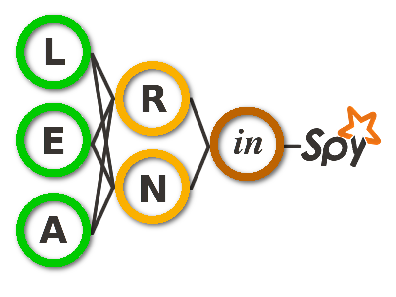

Learninspy
==========

*Deep Learning in Spark, with Python*

### Welcome to learninspy!
Learninspy is a framework for building deep neural networks using Spark features on Python API (PySpark). The project was started in April 2015 by Leandro Ferrado, and it aims to exploit distributed computing capabilities provided by Spark to build and train neural networks with Deep Learning in a simple and flexible way. So, the key features pursued here are:
* **Simple and easy-to-follow:** That's why Python was chosen as the basis for developing on Spark, so this project must be easy to reuse in any application of deep learning.  
* **Extensible:** It has many degrees of freedom on its feature definitions (e.g. activation functions, optimization algorithms and stop criterions, hyper-parameters setup, etc) and of course in a simple way!.
* **Distributed flavor**: Taking advantage of Spark, the main power of learninspy lies in the distribution of both data pre-processing and optimization of neural networks. 

### Dependencies
* Python 2.7.x
* Spark[>=1.3.x, 2.0.x]
* NumPy
* Matplotlib 

## Testing
Run ``nosetests test/`` from the download directory.

## Examples
On the folder ``examples/`` you can find some "demos" (Python files & Notebooks) in order to know how can be used Learninspy on datasets.

### Important links
* Official repository of source: https://github.com/leferrad/learninspy/
* Documentation: http://learninspy.readthedocs.io/ (still in development)
* Contact: ljferrado@gmail.com (Leandro Ferrado)

> DISCLAIMER: Documentation stuff **is in Spanish** due to an agreed scope.
